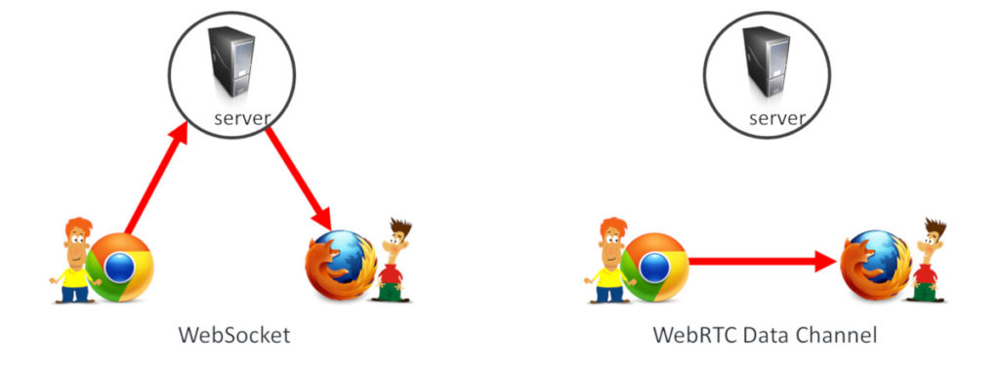
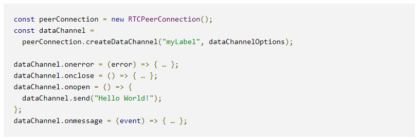

╭╮╭╮╭╮╱╱╭╮╱╭━━━┳━━━━┳━━━╮  
┃┃┃┃┃┃╱╱┃┃╱┃╭━╮┃╭╮╭╮┃╭━╮┃  
┃┃┃┃┃┣━━┫╰━┫╰━╯┣╯┃┃╰┫┃╱╰╯  
┃╰╯╰╯┃┃━┫╭╮┃╭╮╭╯╱┃┃╱┃┃╱╭╮  
╰╮╭╮╭┫┃━┫╰╯┃┃┃╰╮╱┃┃╱┃╰━╯┃  
╱╰╯╰╯╰━━┻━━┻╯╰━╯╱╰╯╱╰━━━╯  

# What is WebRTC
WebRTC (Web Real-Time Communication) is a technology which enables Web applications and sites to capture and optionally
stream audio and/or video media, as well as to exchange arbitrary data between browsers without requiring an intermediary.
The set of standards that comprise WebRTC makes it possible to share data and perform teleconferencing peer-to-peer, 
without requiring that the user install plug-ins or any other third-party software.

# Interoperability
- WebRTC is still evolving
- Each browser has different levels of support for codecs and WebRTC features
- => [Adapter.js](https://github.com/webrtcHacks/adapter) library

## Adapter.js
- Uses shims and polyfills to smooth over the differences among the WebRTC implementations across the environments 
  supporting it
- Handles prefixes and other naming differences to make the entire WebRTC development process easier
- [NPM Package](https://www.npmjs.com/package/webrtc-adapter)

# Concepts and usage
- WebRTC serves multiple purposes (together with [Media Capture and Streams API](https://developer.mozilla.org/en-US/docs/Web/API/Media_Streams_API))
    - support for audio / video
    - file exchange
    - screen sharing
    - ...
    
- Connections between two peers are represented by the `RTCPeerConnection` interface
    - Once a connections has been established and opened
    - media streams / data channels can be added to the connection
    
- Media streams can consist of any number of tracks of media information
    - Tracks may contain ONE of a number of types of media data
        - audio
        - video
        - text (subtitles / chapter names)
    - Most streams consist of at least
        - 1 audio track
        - likely also a video track
    - can be used to send and receive both live media / stored media information (such as a streamed movie)
    
- Can also use the connection between two peers to exchange arbitrary binary data using the `RTCDataChannel` interface
    - Can be used for 
        - back-channel information
        - metadata exchange
        - game status packets
        - file transfers
        - primary channel for data transfer

# WebSockets
- WebSockets are a bidirectional mechanism for browser communication
- 2 types of transport channels for communication in browsers
    - HTTP
    - WebSockets
    
- In short:
    - WebRTC enables sending arbitrary data across browsers without the need to relay that data through a server
      (most of the time). That data can be voice, video or just data.
      
- WebRTC has no signaling channel
    - When starting a WebRTC session, you need to negotiate the capabilities for the session and the connection itself. 
      That is done out of the scope of WebRTC, in whatever means you deem fit.
    - So from this point of view, WebSocket isn’t a replacement to WebRTC but rather complementary – as an enabler
    
- WebRTC's data channel
    - Many different uses
    
    - The the data channels in WebRTC shares a similar set of APIs to the WebSockets ones
    
      
## So what is the difference between WebSockets and WebRTC?
While both are part of the HTML5 specification, WebSockets are meant to enable bidirectional communication between a 
browser and a web server and WebRTC is meant to offer real time communication between browsers 
(predominantly voice and video communications).

## Does WebRTC use WebSockets?
WebRTC doesn’t use WebSockets. It has its own set of protocols including SRTP, TURN, STUN, DTLS, SCTP, …

The thing is that WebRTC has no signaling of its own and this is necessary in order to open a WebRTC peer connection. 
This is achieved by using other transport protocols such as HTTPS or secure WebSockets. 
In that regard, WebSockets are widely used in WebRTC applications.

#TL;DR;
WebSockets were built for sending data in real time between the client and server. Websockets can easily accommodate media.
WebRTC was built for sending media peer 2 peer between 2 clients. It can accommodate data.

# Who uses WebRTC
- Transactis: Transactis is the industry leader in electronic bill presentment and payment technologies. Our solutions 
  simplify your receivables process, increasing your speed of pay and driving customer engagement.
- Pentair plc: A company that works around water (pumps, filters, pools, supply & disposal, quality...)
- Facebook Inc: (we all know who that is :smile:)